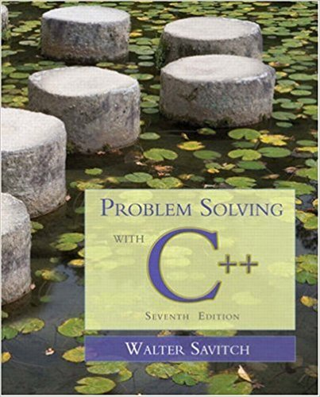

# learning-cpp

Problem Solving with C++

 

  

# Table of Contents

* [Chapter 1](#demo) Introduction to Computers and C++

* [Chapter 2](#demo) C++ Basics

* [Chapter 3](#demo) More Flow of Control

* [Chapter 4](#demo) Procedural Abstraction and Functions

* [Chapter 5](#demo) Functions for All Subtasks

* [Chapter 6](#demo) I/O Streams as an Introduction to Objects

* [Chapter 7](#demo) Arrays

* [Chapter 8](#demo) Strings and Vectors

* [Chapter 9](#demo) Pointers and Dynamic Arrays

* [Chapter 10](#demo) Defining Classes

* [Chapter 11](#demo) Friends, Overloaded Operators, and

* [Chapter 12](#demo) Separate Compilation and Namespaces

* [Chapter 13](#demo) Pointers and Linked Lists

* [Chapter 14](#demo) Recursion

* [Chapter 15](#demo) Inheritance

* [Chapter 16](#demo) Exception Handling

* [Chapter 17](#demo) Templates

* [Chapter 18](#demo) Standard Template Library
